# Architecture Overview

이 문서는 데이터베이스 서비스의 전체 아키텍처를 설명합니다.

## 시스템 구성도

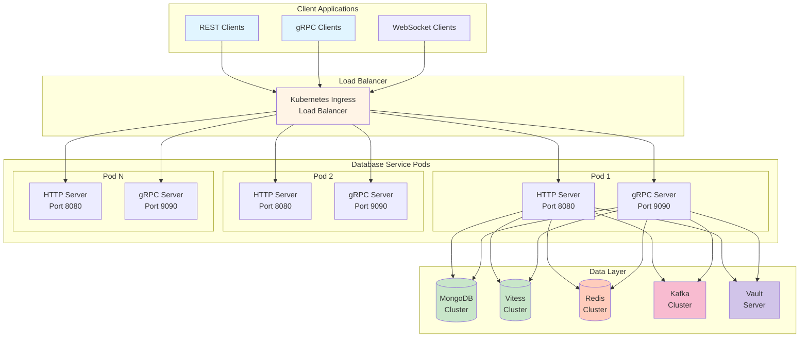

## 계층 아키텍처 (Clean Architecture + DDD)

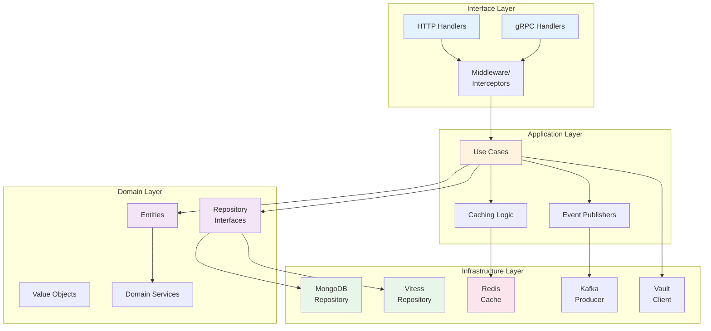

## 주요 컴포넌트

### 1. Domain Layer (DDD)

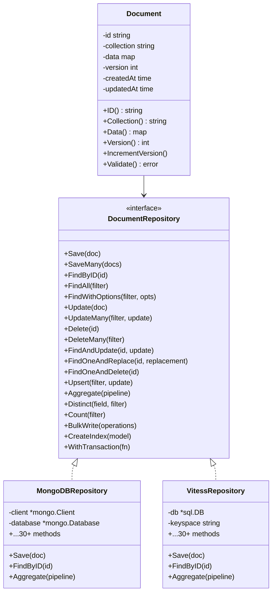

### 2. 문서 생성 흐름

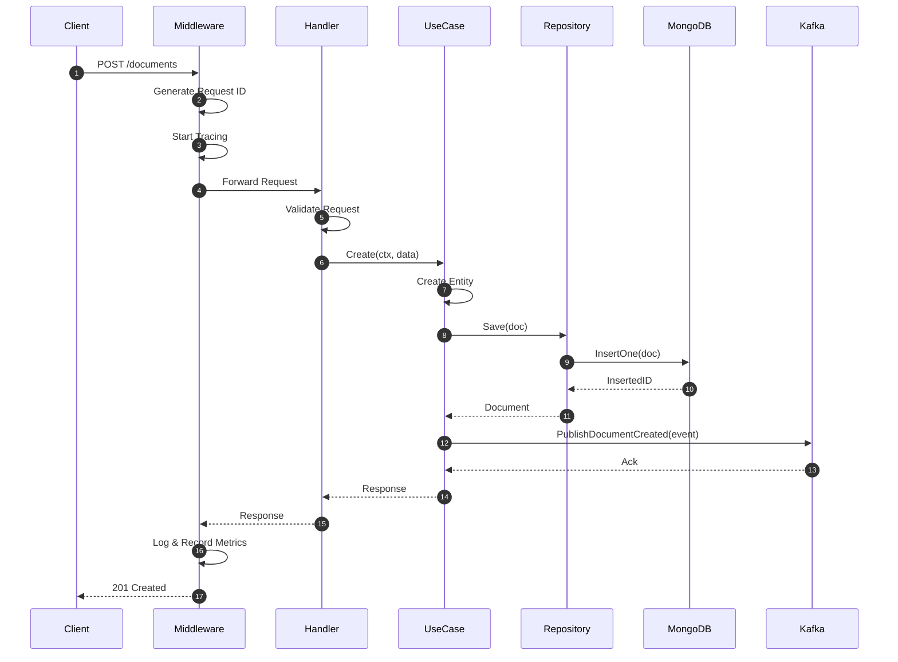

### 3. 캐시 조회 흐름

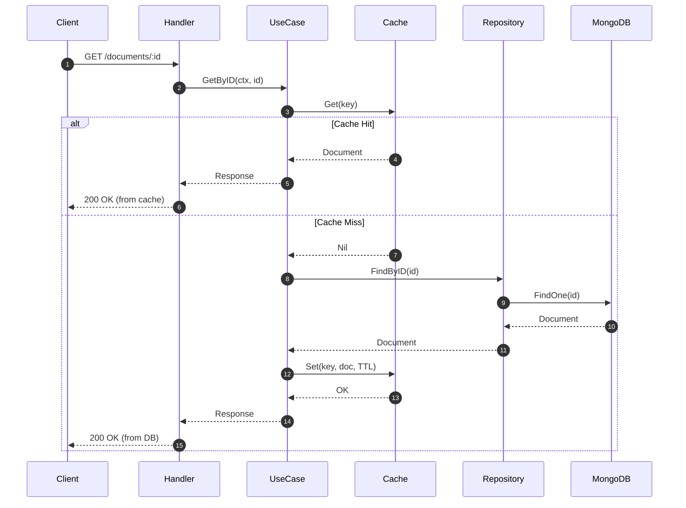

## 인프라스트럭처

### MongoDB 고급 연산

30+ 메서드를 지원하는 MongoDB 구현:

- **기본 CRUD**: Save, FindByID, Update, Delete, FindAll, Count
- **쿼리 연산**: FindWithOptions (Sort, Limit, Skip, Projection), Upsert, Replace
- **벌크 연산**: SaveMany, UpdateMany, DeleteMany, BulkWrite
- **원자적 연산**: FindAndUpdate, FindOneAndReplace, FindOneAndDelete
- **집계**: Aggregate, Distinct, EstimatedDocumentCount
- **인덱스 관리**: CreateIndex, CreateIndexes, DropIndex, ListIndexes
- **컬렉션 관리**: CreateCollection, DropCollection, RenameCollection, ListCollections
- **Change Streams**: Watch, WatchWithResumeToken

### Vitess 고급 연산

MongoDB와 동일한 30+ 메서드를 SQL로 구현:

- **기본 CRUD**: INSERT, SELECT, UPDATE, DELETE
- **쿼리 연산**: JSON_EXTRACT를 활용한 복잡한 쿼리
- **벌크 연산**: 트랜잭션 기반 배치 처리
- **원자적 연산**: SELECT FOR UPDATE (비관적 잠금)
- **집계**: GROUP BY, COUNT, DISTINCT를 활용한 SQL 집계
- **인덱스 관리**: ALTER TABLE을 통한 인덱스 관리
- **컬렉션 관리**: 논리적 컬렉션 (collection 필드 사용)

### Redis 확장 기능

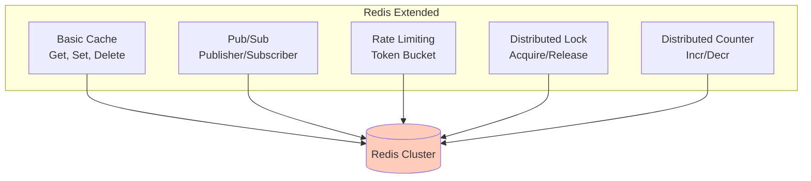

### Kafka CDC

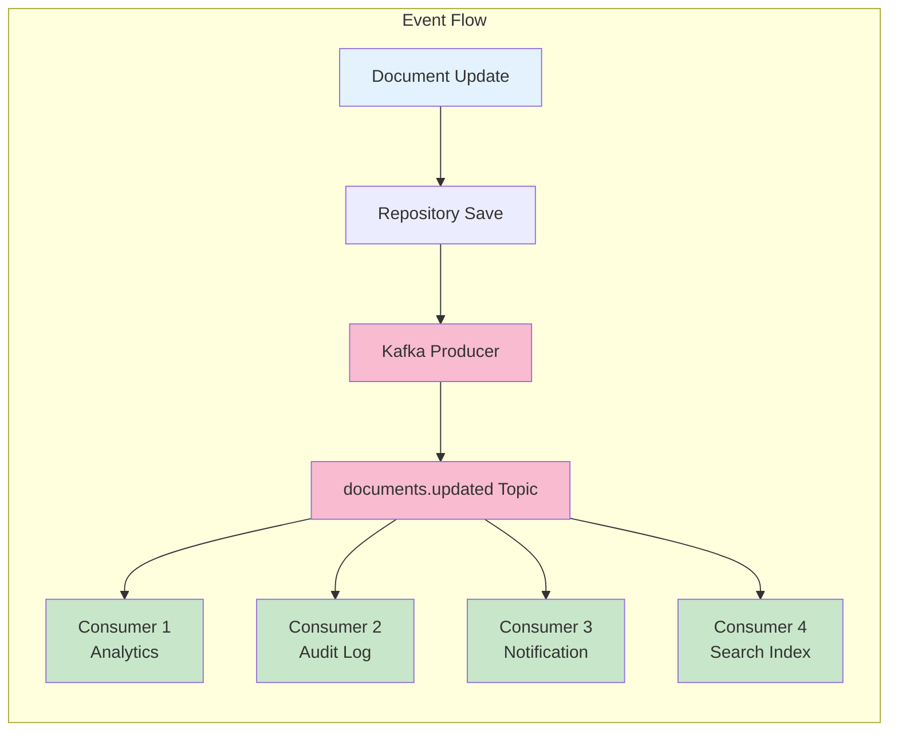

## 보안 (Vault Integration)

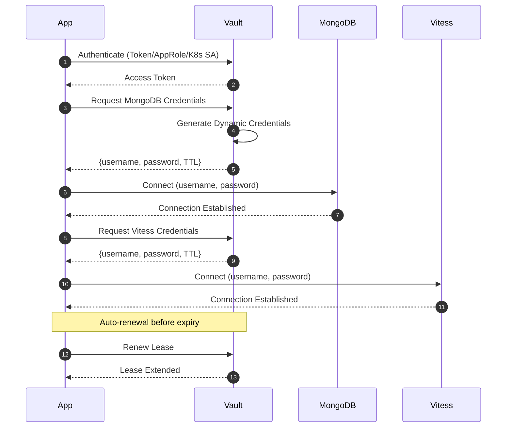

**Vault 기능:**
- 동적 자격증명 (MongoDB, Vitess)
- 정적 시크릿 (API Keys, Redis Password)
- Transit 암호화
- 자동 Lease 갱신

## 확장성

### Horizontal Pod Autoscaler

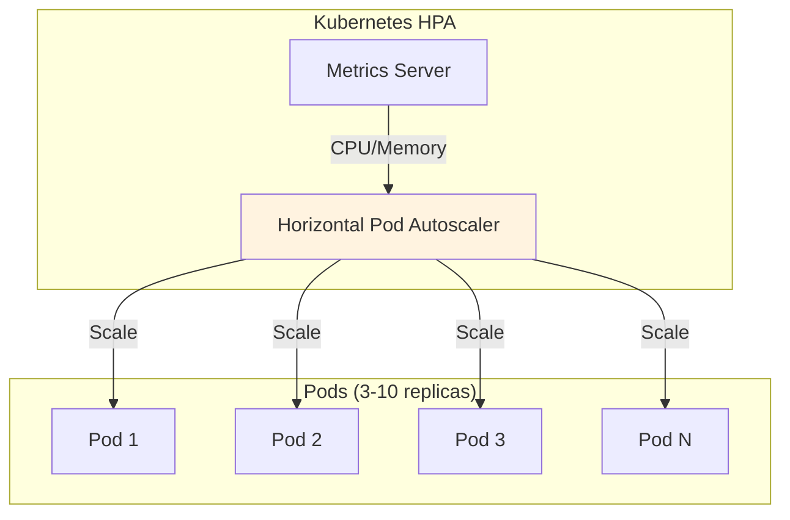

## CI/CD 파이프라인

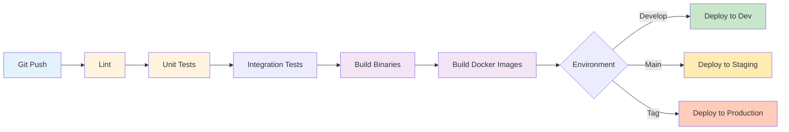

**CI/CD 단계:**
1. **Lint**: golangci-lint 코드 품질 검사
2. **Test**: 유닛 테스트 + 통합 테스트
3. **Build**: Go 바이너리 빌드
4. **Docker**: 멀티스테이지 Dockerfile
5. **Deploy**: Kubernetes 배포 (Dev → Staging → Production)

## Observability

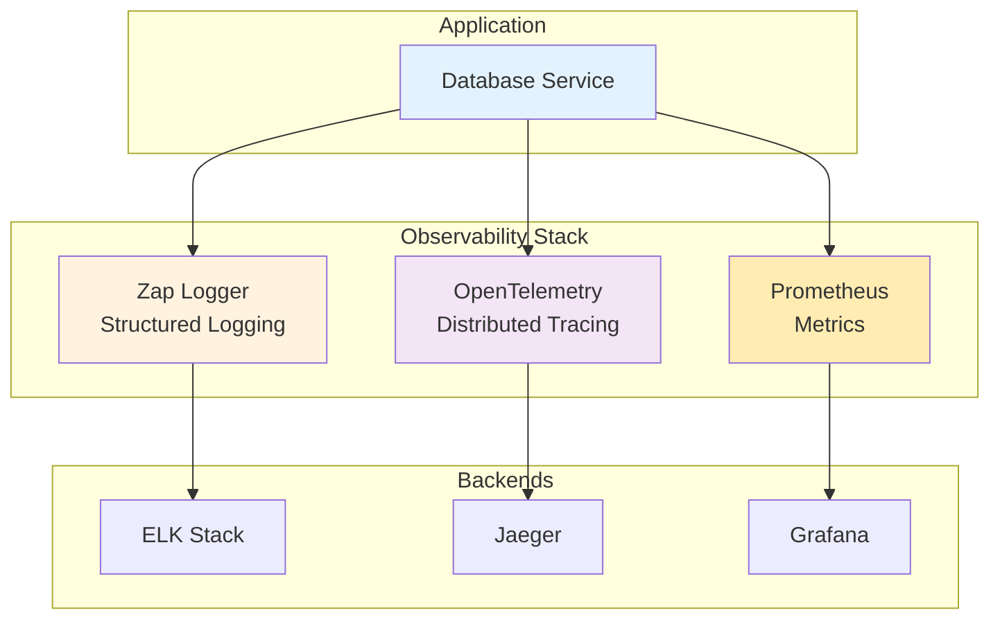

**메트릭:**
- Request Rate, Error Rate
- Latency (p50, p95, p99)
- DB Connection Pool
- Cache Hit Rate
- Kafka Lag

## 참고 자료

- [Vault Integration Guide](./VAULT_INTEGRATION.md)
- [GitLab CI/CD Configuration](../.gitlab-ci.yml)
- [Kubernetes Deployments](../deployments/kubernetes/)
- [Configuration Guide](../configs/)
- [Complete Example](../examples/complete_example.go)
